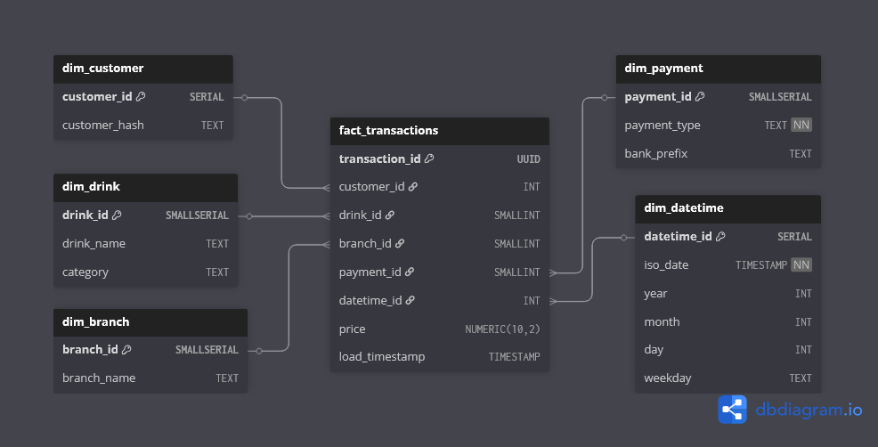

# Obscured-by-Clouds (OBC)


<br>

**Obscured-by-Clouds (OBC)** is a modular ETL pipeline project designed to handle data transformation securely and transparently, revealing what’s *obscured by the cloud*.  
Version v0.91 now includes enhanced data handling, terminal UI, logging, and GUID-ready database insertion.


<br>


## 🏷 Version v0.91 Release

This release introduces **improved terminal output** for the ETL pipeline:

- Fully modular **Extract → Transform → Load** pipeline.
- **UI integration** for interactive terminal stats and filtered displays.
- GUID generation for transactions and basket items, preparing data for 3NF database structures.
- Enhanced **data validation and logging**:
  - Skips rows with invalid or missing prices.
  - Logs anomalies for audit.
- Rich console output and pretty tables for readability.
- Shortened and anonymised Transaction IDs and Customer Hashes.
- Prepared for cloud-ready extensions in future releases.

---


## 🚀 How to Run


Follow these steps to run the local ETL pipeline and see the pretty terminal output:

1. **Clone the repository** (if not already):

```bash
git clone https://github.com/Eng-ADAL/Obscured-by-Clouds.git
cd Obscured-by-Clouds
```

### 🏃‍♂️ Quick Start
Full obc_app experience (database adminer automation)
```bash
# Windows
setup.ps1

# mac / Linux
chmod +x setup.sh
./setup.sh
```

### Developer mode
Activate your Python virtual environment:

```bash
Copy code
python3 -m venv obc_venv
source obc_venv/bin/activate       # Linux/macOS
# .\obc_venv\Scripts\activate     # Windows
```

Install dependencies (if any; currently just standard library, future Rich integration optional):


```bash
Copy code
pip install -r requirements.txt   # optional, if you add rich later
Place your raw data in data_raw/raw_data.txt.
```


Run the ETL pipeline:

```bash
Copy code
python3 source/app.py
```

## ❄ Database Schema 
This section outlines the structure of the database, including tables, relationships, and key fields. It serves as a reference for understanding how data is organised, ensuring clarity for development, maintenance, and future enhancements.





---

## 🌍 Project Overview

OBC is a two-phase ETL system:

1. **Local ETL Pipeline (Current Phase)**  
   - Extract raw transaction data from local sources.
   - Anonymise PII via salted hashes.
   - Validate, clean, and transform data.
   - Assign GUIDs for Transactions and Basket Items.
   - Load processed data into a local database (via dal.py) for verification.
   - Interactive terminal UI for monitoring and stats.

2. **Cloud Integration (Next Phase)**  
   - Data synchronisation with **Cloud** for automated ingestion.  
   - Scalable orchestration for distributed processing.  
   - Secure access control and monitoring via cloud-native tools.

---

## 🧩 Local Architecture

```text
raw_data/
   ↓
extract.py          # Extract & anonymise
   ↓
transform.py        # Validate & transform to 3NF-ready structures
   ↓
save_cleaned.csv    # Optional intermediate file
   ↓
load.py             # Insert into local DB (GUIDs generated here)
   ↓
dal.py              # Data access layer
ui.py               # Terminal stats & interaction
local_database/
logs/               # Validation & skipped rows logs

````

---

## 🧠 Design Principles

* **Privacy-first**: Hash and drop PII fields immediately after extraction.
* **Transparency**: Each ETL step logged locally for audit and debugging.
* **Modularity**: Each stage (extract, transform, load) runs independently or in sequence.
* **Reproducibility**: Deterministic transformations and testable outputs.
* **Robustness**: Skipped row logging and validation prevent silent data corruption.
* **Scalability-ready**: Modular design allows future cloud migration.
---

## 📅 Roadmap

 * [x] Local ETL pipeline with interactive terminal UI (v0.91)
 * [x] GUID-based 3NF-ready transformations
 * [x] Skipped-row logging and anomaly handling
 * [ ] Unit testing for each ETL component
 * [ ] Cloud ETL orchestration
 * [ ] CLI interface and automation scripts
 * [ ] Extended documentation (documentation.txt)


---

## 🧭 Vision

OBC bridges local data reliability with cloud-scale automation — a pipeline evolving from your laptop to the stratosphere.
Every dataset has hidden truths; OBC reveals them responsibly.

<br>

---

*"Data, much like a symphony, reveals its true form only when the chaos is silenced and each note is precisely orchestrated."*

```
