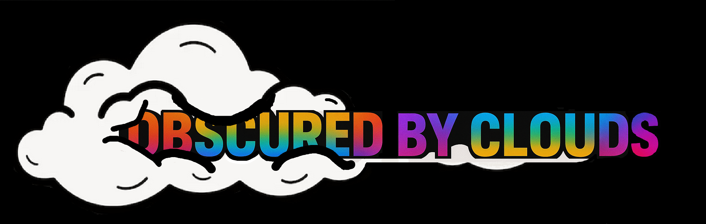
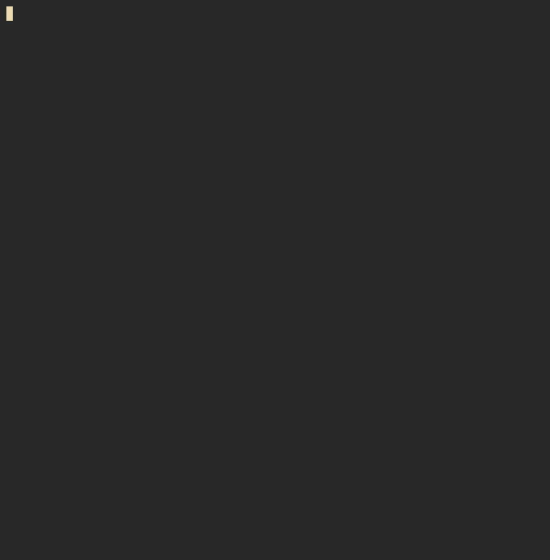

# Obscured-by-Clouds (OBC)



<br>

**Obscured-by-Clouds (OBC)** is a modular ETL pipeline project designed to handle data transformation securely and transparently, revealing what’s *obscured by the cloud*.  
This first phase focuses on the **local data pipeline**, establishing clean, reproducible processes before extending to cloud infrastructure.

<br>


## 🏷 Version v0.7 Release

This release introduces **improved terminal output** for the ETL pipeline:

- Extract and Transform finished
- Pretty-printed, aligned table of transformed data.
- Abbreviated Transaction IDs and Customer Hashes for easy readability.
- Shortened date display (YYYY-MM-DD).
- Cleaned up accidental tracked files (temp, vim sessions, asciinema casts).
- Rich console integration.

---


## 🚀 How to Run

Follow these steps to run the local ETL pipeline and see the pretty terminal output:

1. **Clone the repository** (if not already):

```bash
git clone https://github.com/<your_username>/Obscured-by-Clouds.git
cd Obscured-by-Clouds
```

Activate your Python virtual environment:

```bash
Copy code
python3 -m venv obc_venv
source obc_venv/bin/activate       # Linux/macOS
# .\obc_venv\Scripts\activate     # Windows
```

Install dependencies (if any; currently just standard library, future Rich integration optional):


```bash
Copy code
pip install -r requirements.txt   # optional, if you add rich later
Place your raw data in data_raw/raw_data.txt.
```


Run the ETL pipeline:

```bash
Copy code
python3 source/app.py
```

**Demo:**  



---

## 🌍 Project Overview

OBC is a two-phase ETL system:

1. **Local ETL Pipeline (Current Phase)**  
   - Extracts raw transaction data from local sources.  
   - Hashes and anonymises personally identifiable information (PII).  
   - Cleans and transforms data into a **3NF database structure** (Transactions, Basket Items, etc.).  
   - Loads processed data into a local database for validation and testing.

2. **Cloud Integration (Next Phase)**  
   - Data synchronisation with **Cloud** for automated ingestion.  
   - Scalable orchestration for distributed processing.  
   - Secure access control and monitoring via cloud-native tools.

---

## 🧩 Local Architecture

```text
raw_data/
   ↓
extract.py
   ↓  (hash PII using salted hash)
transform.py
   ↓
save_cleaned.csv (optional)
   ↓
load_to_db.py
   ↓
local_database/
````

---

## 🧠 Design Principles

* **Privacy-first**: Hash and drop PII fields immediately after extraction.
* **Transparency**: Each ETL step logged locally for audit and debugging.
* **Modularity**: Each stage (extract, transform, load) runs independently or in sequence.
* **Reproducibility**: Deterministic transformations and testable outputs.

---

## 📅 Roadmap

* [x] Local ETL pipeline with pretty terminal output
* [ ] Unit testing for each ETL component
* [ ] Cloud ETL orchestration
* [ ] Logging and monitoring system
* [ ] Documentation and CLI interface

---

## 🧭 Vision

OBC aims to bridge **local data reliability** with **cloud-scale automation** — a pipeline that evolves from your laptop to the stratosphere. Every dataset has its hidden truths; OBC is about revealing them responsibly.

<br>

---

*"Data, much like a symphony, reveals its true form only when the chaos is silenced and each note is precisely orchestrated."*

```

---
